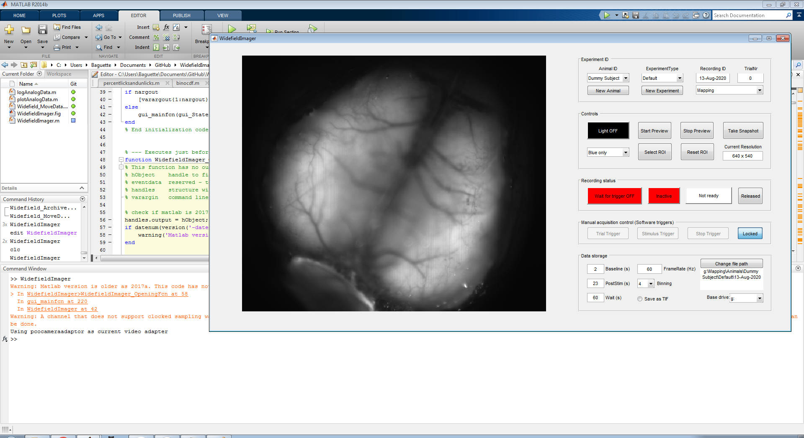
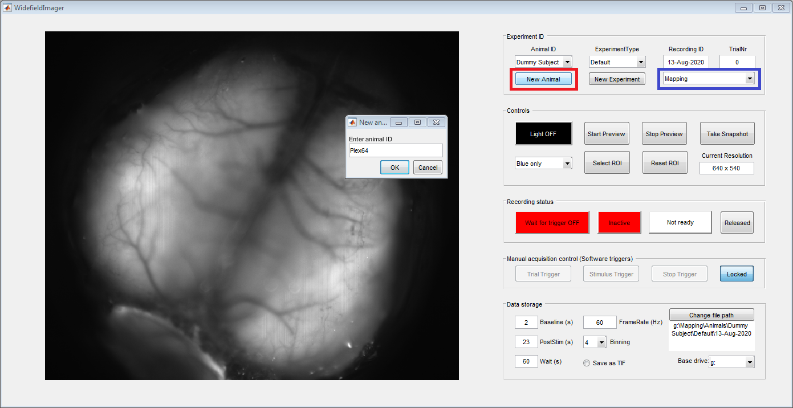
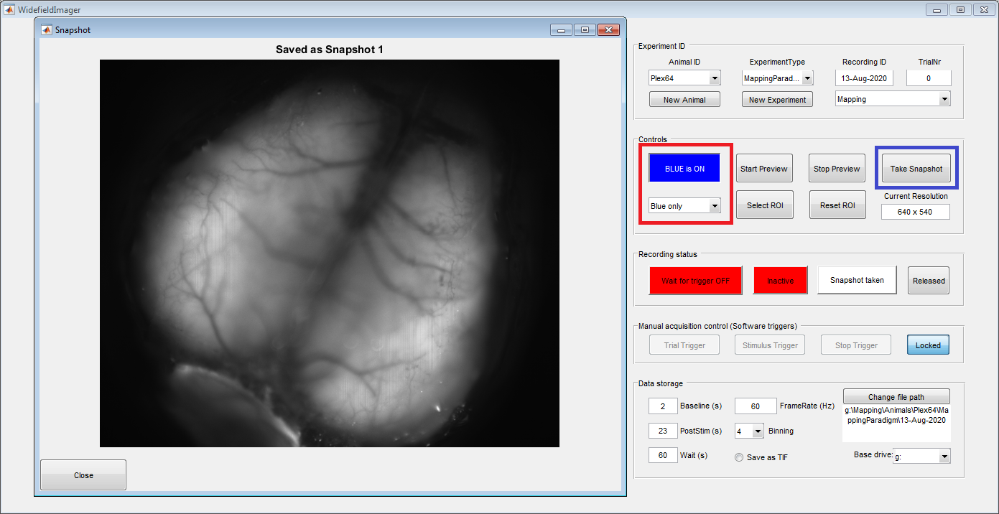
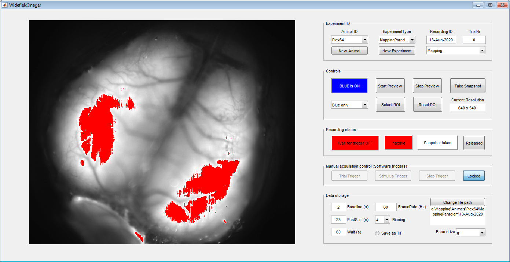
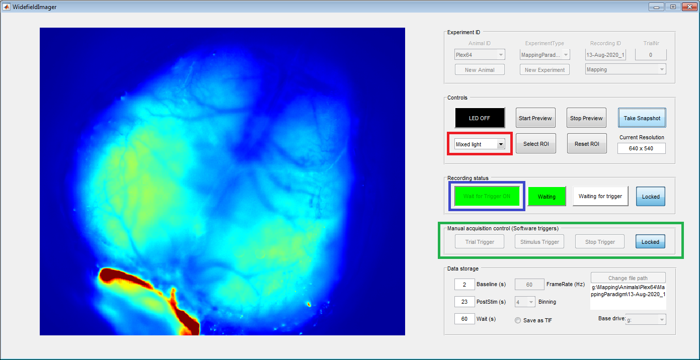
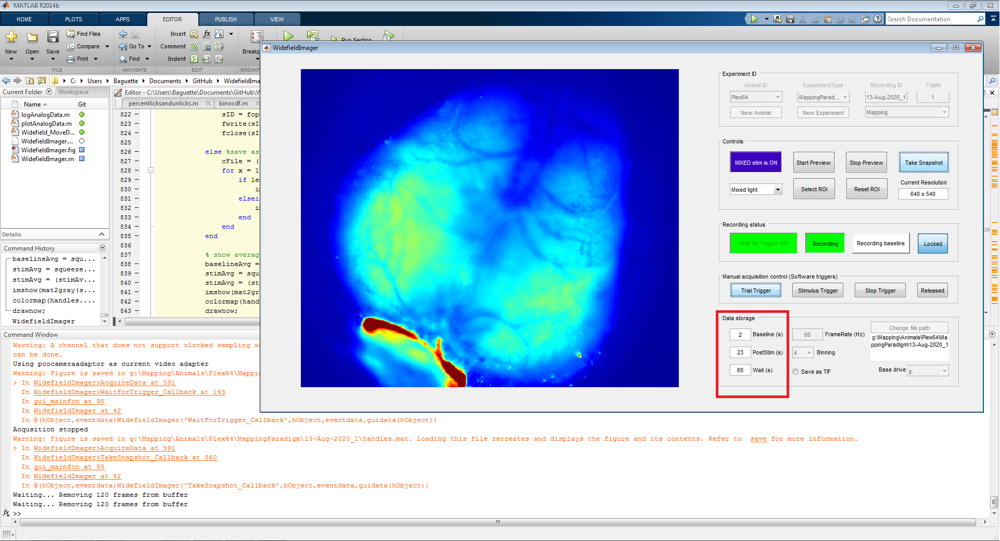
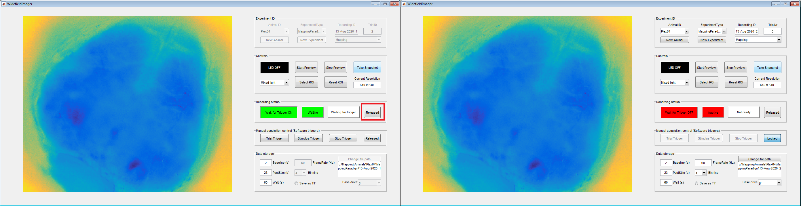

# WidefieldImager
This repo contains Matlab-based acquisition software and a pre-processing pipeline for widefield imaging. 
The software was used for the publication 'Single-trial neural dynamics are dominated by richly varied movements' by Musall and Kaufman et al.. 

Imaging data from the study can be found [here](http://repository.cshl.edu/id/eprint/38599/).

See also https://github.com/jcouto/wfield for alternative Python code with extended functionality.

Some of the dimensionality-reduction analysis is based on [code](https://github.com/cortex-lab/widefield) from Kenneth Harris and Matteo Carandini's lab.

# Overview
The 'WidefieldImager' folder contains the widefield acquisition software. 'LEDswitcher' contains code for a Teensy microcrontoller (https://www.pjrc.com/store/teensy32.html) to control blue and violet excitation LEDs in the widefield setup. 
The 'CAD' folder contains 3-D models for different parts that are useful for head-fixed imaging, such as headbars and clamps and a light-shielding cone.
The 'Analysis' folder contains a Matlab pipeline to perfornm linear dimensionality reduction (using localized singular value decomposition) and hemodynamic correction on raw imaging data. 

# Requirements
There are no specific requirements for the imaging PC. However, it is recommended to use a large (>=1TB) solid state drive and sufficient RAM (>=16GB). Since data is streamed to working memory and only written to disc between trials, this is particularly important when continuously imaging for longer durations or at high frame rates.

The pre-processing pipeline also benefits from sufficient RAM (>= 16GB). The optional GPU-acceleration requires a CUDA compatible GPU from Nvidia, ideally with at least 6GB of VRAM.

The WidefieldImager requires Matlab and the Image Acquisition Toolbox (IMAQ). A working camera adaptor has to be installed (either from the vendor or Mathworks [image acquisition support packages](https://www.mathworks.com/help/imaq/image-acquisition-support-packages-for-hardware-adaptors.html). Use 'imaqhwinfo' to make sure the adaptor is properly installed. Our setup runs on Matlab 2014b and the code has been tested up to Matlab 2017a. Minor adjustments might be needed for newer Matlab versions.

To receive triggers and control excitation LEDs, a National Instruments data acquisition (DAQ) card is needed. We use the [USB-6001](https://www.ni.com/en-us/support/model.usb-6001.html), which is fairly cheap and easy to use.

For full functionality, connect the DAQ and Teensy as shown in the diagram below.


# Widefield acquisition software
The software is designed to work with a PCO.edge 5.5 camera but other cameras can be used as well (with pixel binning disabled). WidefieldImager should work with most cameras that can be used with Matlab's ImageAcquisition toolbox.
When using a PCO camera, make sure to install all required drivers, the Matlab adaptor package and the CamWare software. In Camware, set the Exposure trigger to 'All lines' and close it before starting Matlab. This is important to ensure that the exposure trigger is limited to times when the entire imaging chip is being exposed.

Instead of continously streaming imaging data, the software can be triggered to selectively acquire data in a trialized format. This has the advantage that excitation lights are only on during times of interest (to avoid photo bleaching) and the resulting data sets are much more managable in size. Frames are saved in a raw format but lossless compression methods (such as zip or JPEG200 compression) can be used to further reduce data size.

## Usage
Clone or download the repository to your imaging PC and add it to your Matlab path. Type 'WidefieldImager' to run the acqusition software.

Type ```WidefieldImager``` in the Matlab command window to bring up the main window.



The panel on the left should show a preview from the camera. Use the 'New Animal' button (red box) on the top 'Experiment ID' panel to register a new animal: Enter animal ID and a name for the current experiment. In future experiments, registered animals can be directly selected from the top left drop-down menu. 
To allow for more flexibility, two types of experiments can be selected in the drop-down on the top righ (blue box): Mapping or Behavior. This selection affects the path where imaging data will be saved (indicated in the bottom right, in the 'Data Storage' panel). By default, the duration of the postimulus period is set to 23 seconds for mapping and 2 seconds for behavioral experiments.



Note that mice are only registed for the currently selected datapath. When changing the harddrive (with the drop-down selector 'Base drive' on the bottom right) or the experiment type, the mouse needs to be registed again.

Once the animal is placed under the macroscope and the vessels are in focus, use the LED controls (red box) to switch on the blue light. Then take a picture of the vessel pattern using the "Take Snapshot" (blue box) button. Make sure the aperture is fully opened for maximal sensitivity and a narrow imaging plane. 



You can use the drop-down to switch between blue, violet and alternating (mixed) illumination. Make sure you get a good image with both blue and violet light. To avoid saturating the camera, the color of the preview will switch to red when 70% of the dynamic range of the camera has been reached. In our hands, this is a good level to avoid clipping artefacts (from saturated pixels) or strong sample bleaching. In both colors, turn up the light power until you start seeing red pixels (see below example) and then reduce the power again to stay below that threshold.



If you only want to image a smaller region-of-interest, use the 'Select ROI' button to crop the image. The preview window will freeze and you can draw a rectangle for ROI selection with the left mouse button. Click in the image and drag the rectangle to select the correct ROI. The size and position of the recangle can still be adjusted after its drawn. Double-click the rectangle to confirm ROI selection or the escape key to abort. Use the 'Reset ROI' button to get back to the whole field of view.

To start imaging, change the excitation light to “Mixed light” (red box) and click the “Wait for trigger” button (blue box). The software will now wait for a stimulus trigger from a behavioral or stimulation system. You can also generate software triggers in the 'Manual acquisition control' panel (green box). This panel is automatically enabled when the imaging is started without a DAQ. Otherwise, use the 'Locked' button on the right to enable trigger control.



The software expects three types of triggers: 'Trial', 'Stimulus' and 'Stop'. When the imaging is started, the software waits for a trial trigger to start acquiring frames. However, these frames are only saved temporarily until a stimulus trigger is received (image below). This was done to allow more flexibility if the stimulus time is not fully pre-determined (e.g. when the animal needs to trigger the stimulus).

After the stimulus trigger, the software keeps acquiring frames until the end of the 'PostStim' period is reached or a stop trigger is received. This indicates the end of a trial and a datafile is saved to the harddrive. 
This file contains frames according to the baseline and post-stimulus period. The duration of these periods can be adjusted in the according fields (red box) in the 'Data storage' panel on the bottom right. The 'Wait' period indicates the maximum duration the software will wait for a stimulus trigger after receiving a trial trigger. After that, the current trial is considered a miss and a new trial trigger is needed to start the next trial.



In addition, five 'dark frames' without any exposure light are recorded after the post-stimulus period. This is done as a failsave when reconstructing the excitation light color of the last frame in the post-stimulus period during subsequent analysis. 
There also needs to be a brief pause between trial end and start of the next trial (usually 1-2 seconds, depending on data size and hardware) to allow writing to disc. 

By default the imaging data is saved in a flat binary file called 'Frames_*currentTrialNumber*.dat'. Data can also be saved as TIF stacks. In this case saving data will be a bit slower.

Once the session is completed, click the 'Locked' button on the right side of the 'Recording status' panel (red box in left image below). This unlocks the control button on the left, labeled 'Wait for Trigger ON'. Click the button to end the current session (right image below).



# Widefield pre-processing software
Clone or download the repository to your analysis PC and add it to your Matlab path. You can either analysis your own imaging data or download a demo recording from the CSHL repository (in the folder 'DemoRec'). Navigate to the folder that contains your imaging data in a folder named 'DemoRec', then type ```edit Tutorial_dimReduction.m```

Tutorial_dimReduction is a demo script that contains different variables that are relevant for pre-processing. All variables are described in the script and should be self-explanatory. Write an issue report if there are any problems and I'll try to assist.

The pipeline has multiple steps: blockSVD separates the imaging frames into smaller blocks and performs linear dimensionality using randomized SVD. This steps returns block-wise data 'bV' and 'bU'.
A second SVD is used to isolate common temporal dimensions across all blocks, representing the main temporal components for the whole data set. These components 'nV' are then used to compute the corresponding whole-frame spatial components 'U'.
Lastly, 'SvdHemoCorrect' performs hemo-dynamic correction on the low-dimensional data by regressing out fluoresence with violet illumination from blue illumination frames.

The resulting dataset 'Vc' represents the corrected imaging dataset. To restore individual frames simply transpose U and Vc (second dimension of Vc are frames). 
For example

```rawData = svdFrameReconstruct(U,Vc(:,1:10));```

will restore the first 10 frames in the current dataset. 
The 'index frameCnt' contains the number of frames per trial and 'stimTime' indicates at which trial a stimulus was presented'. Using these variables you can reconstruct imaging data from different trials or responses to stimulus events of interest.
